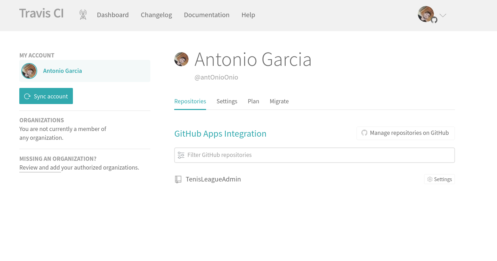
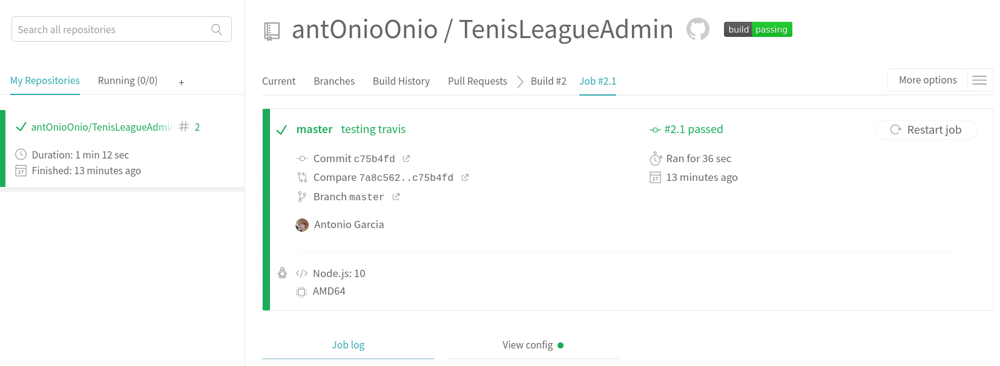
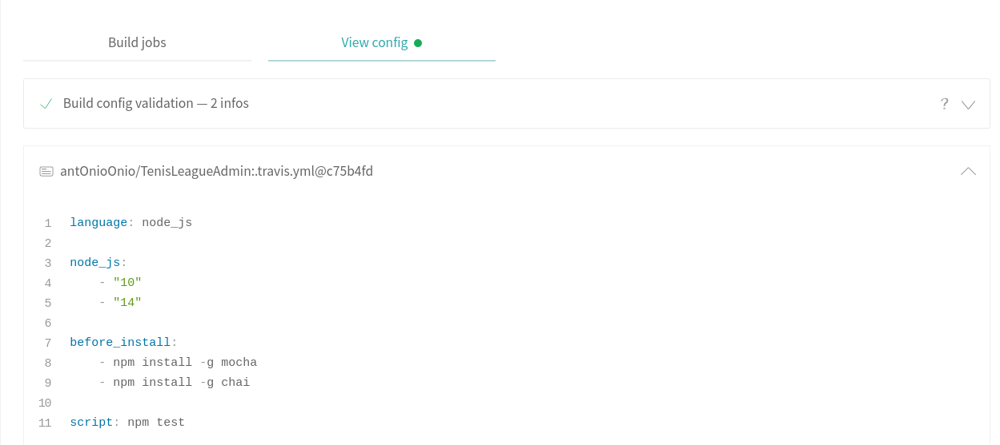

## Ejercicio 9.

### 2.1 Darse de alta. Muchos están conectados con GitHub por lo que puedes autentificarte directamente desde ahí. A través de un proceso de autorización, puedes acceder al contenido e incluso informar del resultado de los tests a GitHub.

### 2.3 Activar el repositorio en el que se vaya a aplicar la integración continua. Travis permite hacerlo directamente desde tu configuración; en otros se dan de alta desde la web de GitHub.

Los pasos son muy sencillos, te puedes logear directamente con tu cuenta de github, acto seguido lo único que tienes que hacer es conectar con tu cuenta de github y seleccionar que repositorio quieres enlazar.

### 2.3 Crear un fichero de configuración para que se ejecute la integración y añadirlo al repositorio.

Creamos nuestro archivo [.trayvis.yml](https://github.com/antOnioOnio/TenisLeagueAdmin/blob/master/.travis.yml). Travis automḿaticamente ejecuta lo ejecuta por defecto con cada push. 

## Ejercicio 10. Configurar integración continua para nuestra aplicación usando Travis o algún otro sitio.
