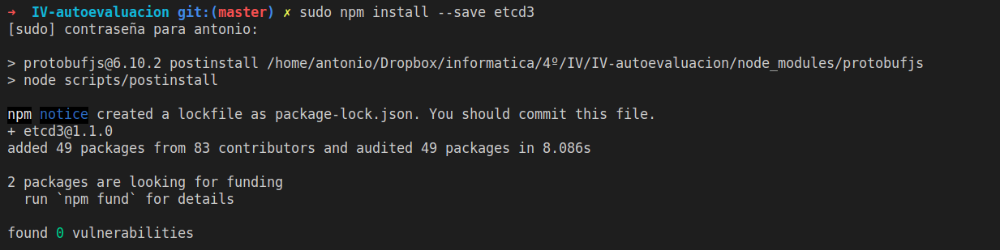
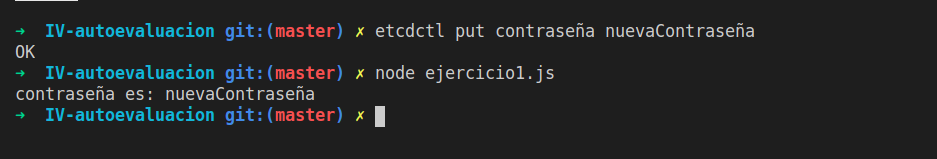

# Ejercicio 1

~~~
Instalar etcd3, averiguar qué bibliotecas funcionan bien con el lenguaje que estemos escribiendo el proyecto (u otro lenguaje), y hacer un pequeño ejemplo de almacenamiento y recuperación de una clave; hacer el almacenamiento desde la línea de órdenes (con etcdctl) y la recuperación desde el mini-programa que hagáis.
~~~
Lo primero que tengo que hacer es instalar etc, para ello ejecutamos 

    sudo apt install etcd

La mejor librería para trabajar con node es [etcd3](https://www.npmjs.com/package/etcd3) 
Para instalarlo simplemente ejecutamos 

    sudo npm install --save etcd3

Para poder interaccionar desde la terminal, nos vamos a la documentación oficial de nuevo y ejecutamos 

    export ETCDCTL_API=3

Escribimos un ejemplo básico.

~~~
const { Etcd3 } = require('etcd3');
const client = new Etcd3();
 
(async () => {

 
  const psw = await client.get('contraseña').string();
  console.log('contraseña es:', psw);

  await client.delete().all();
})();
~~~

# Ejercicio 2

~~~
Realizar una aplicación básica que use express para devolver alguna estructura de datos del modelo que se viene usando en el curso.
~~~

El primer paso ha sido instalar express con el comando :

    npm install express --save

El programa realizado simplemente tiene una ruta por defecto en el que mostramos un mensaje de bienvenida y devolvemos un objeto random en la ruta /Player

~~~
var express = require('express')
var app = express();
var port = 3000

app.get('/',function(req,res){
    res.send({"HALO":"Welcome to the landing page"})
});

const perfectPlayer = {
    "velocidad": "infinita",
    "edad": "inmortal",
    "poder": "ilimitado"
};
app.get('/Player',function(req,res){
    
    res.send(perfectPlayer)
 
});

module.exports = app;

~~~

