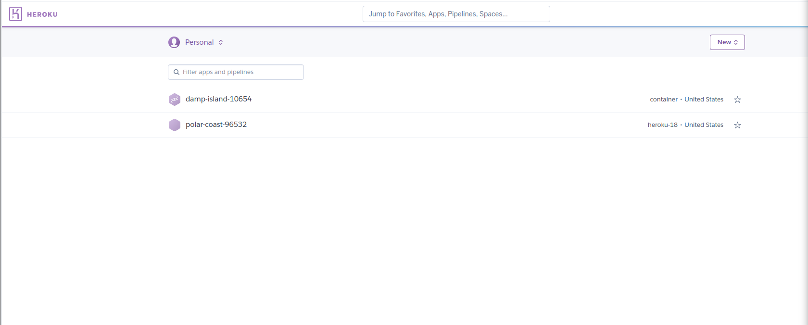
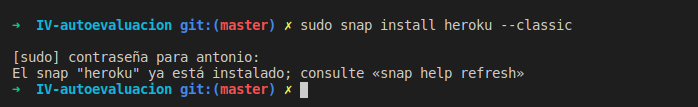
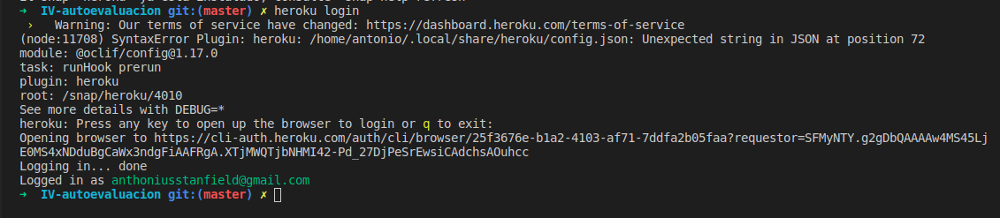
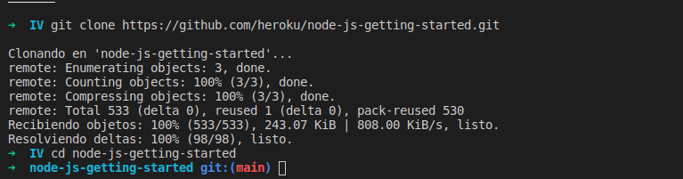
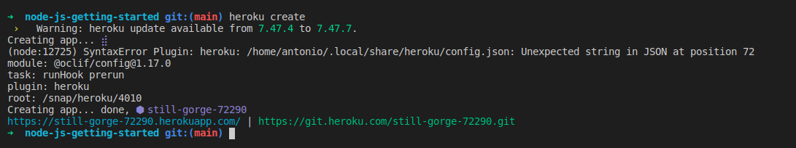
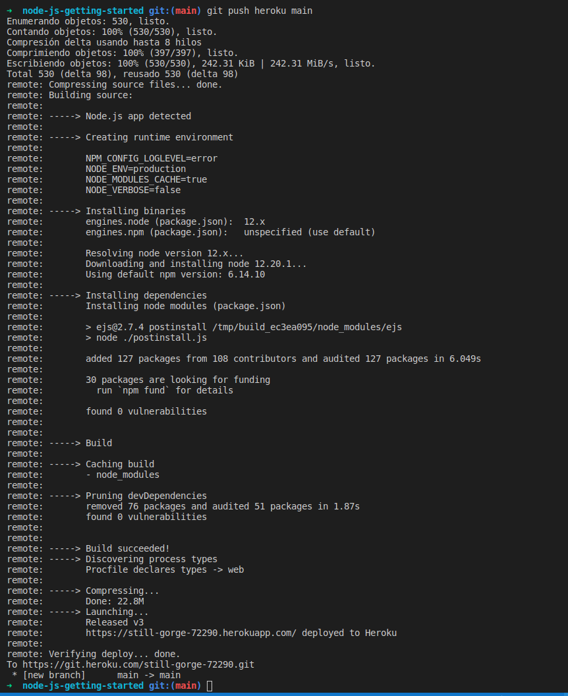
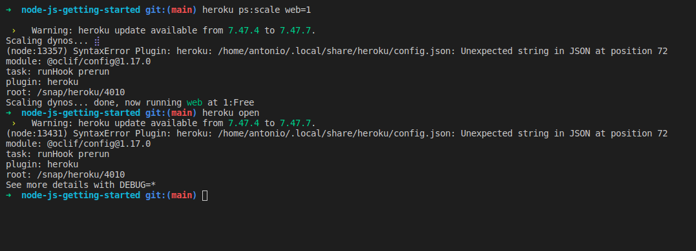

# Ejercicio 1

~~~
Darse de alta en algún servicio PaaS tal como Heroku o BlueMix o usar alguno de los PaaS de otros servicios cloud en los que ya se esté dado de alta.
~~~

Ya estaba dado de alta en heroku ya que cursé en 2019 DAI. 

# Ejercicio 2

~~~
Crear una aplicación en OpenShift o en algún otro PaaS en el que se haya dado uno de alta. Realizar un despliegue de prueba usando alguno de los ejemplos incluidos con el PaaS.
~~~

Lo primero que he hecho es irme a la [documentación oficial](https://devcenter.heroku.com/articles/getting-started-with-nodejs). Nos muestran una pequeña guía para desplegar nuestra primera aplicación.

Lo primero es instalar nuestro cliente

Y logearnos.

Siguiendo los pasos clonamos el repositorio de la aplicación de prueba tal como dice la documentación.

Creamos la app

Desplegamos

Con el primer comando nos aseguramos que al menos una instancia este corriendo, con el segundo abrimos nuestra app

