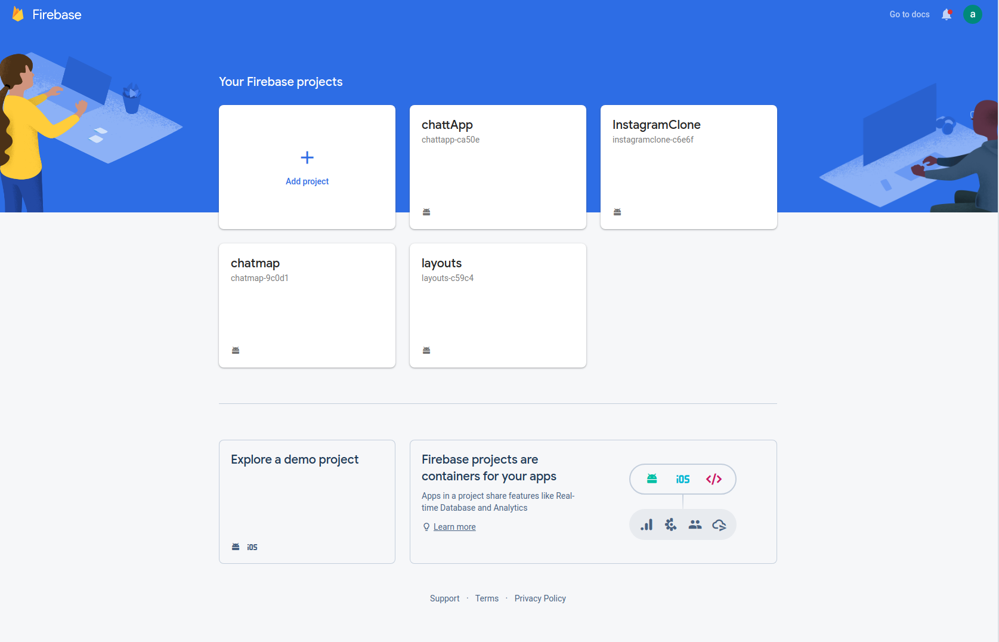
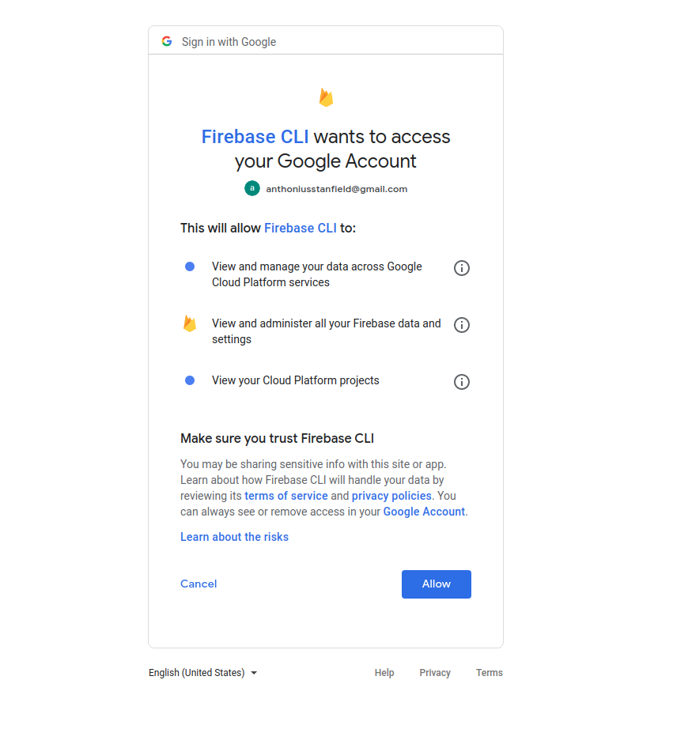
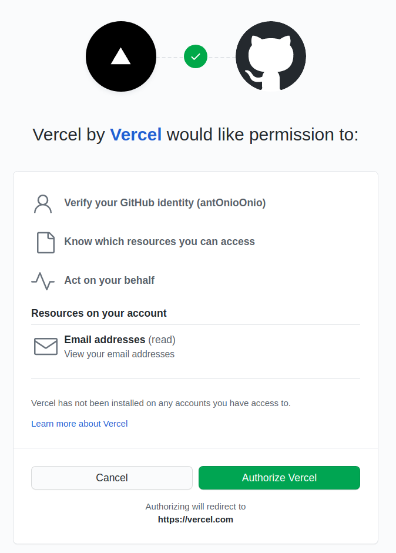
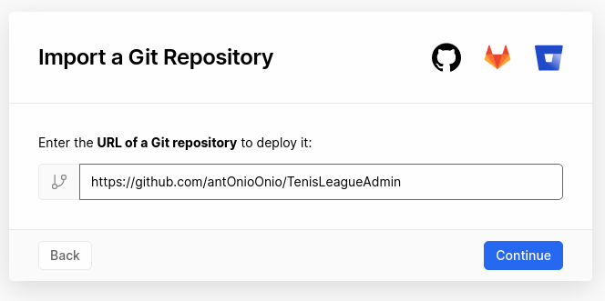
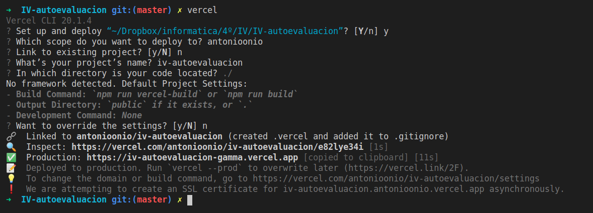
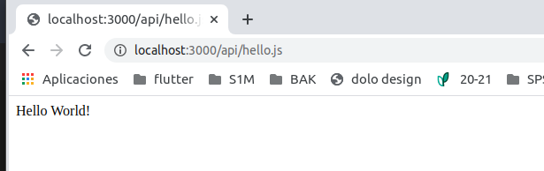

# Serverless computing

## Ejercicio 1. Darse de alta en Vercel y Firebase, y descargarse los SDKs para poder trabajar con ellos localmente.

### Firebase
En el servicio Firebase ya estaba dado de alta ya que he realizado varios proyectos personales en esta plataforma.

Para hacer uso de Firebase localmente debemos descargar su SDK, para ello debemos ejecutar:

    npm install -g firebase-admin

    npm install -g firebase-admin

    npm install -g firebase-functions

Una vez realizado, debemos loguearnos localmente. Para ello ejecutamos:

    firebase login

Y se nos abrirá la página para aceptar

### Vercel

Primer paso es registrarte. Lo podemos hacer directamente con nuestra cuenta de github y dar permisos para poder enlazar con nuestros repositorios.

Una vez realizados los pasos, para trabajar localmente con vercel debemos instalarlo, para ello ejecutamos:

    npm i -g vercel

La primera vez que ejecutamos vercel localmente debemos verificar nuestro correo. La siguiente ya nos permite configurar y desplegar.

## Ejercicio 2. Tomar alguna de las funciones de prueba de Vercel, y hacer despliegues de prueba con el mismo.

Para realizar el ejercicio he creado un [repositorio nuevo](https://github.com/antOnioOnio/vercelBasicTest) en el cual he creado un directorio /api y un fichero hello.js con el siguiente contenido. 

~~~
module.exports = (req, res) => {
    const { name = 'World' } = req.query
    res.status(200).send(`Hello ${name}!`)
  }
~~~

Para comprobar que funciona corremos vercel en local y nos vamos a la dirección correspondiente.

