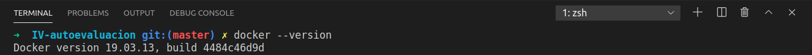
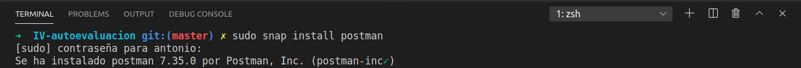
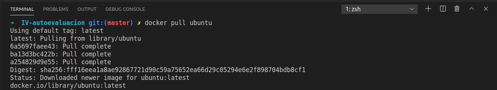
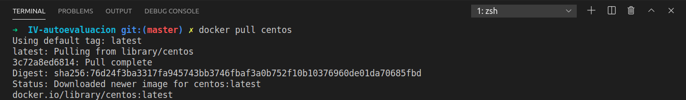
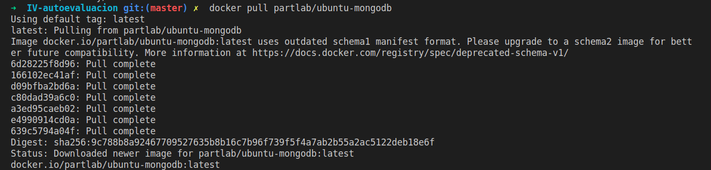
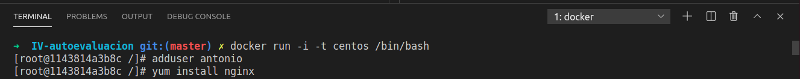
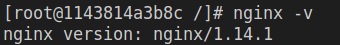

# Ejercicios autoevaluación tema 3
## Ejercicio 1.
Instalar docker y/o otro gestor de conteneodres como Podmn/Buildah

Docker ya lo tenía instalado ya que el año pasado cursé la asignatura DAI y en ella se trataba docker. 

Se ha instalado postman

## Ejercicio 2.

### 2.1 Instalar a partir de docker una imagen alternativa de Ubuntu y alguna adicional, por ejemplo de CentOS.

### 2.2 Buscar e instalar una imagen que incluya MongoDB.

## Ejercicio 3
Crear un usuario propio e instalar alguna aplicación tal como nginx en el contenedor creado de esta forma, usando las órdenes propias del sistema operativo con el que se haya inicializado el contenedor.

Se muestra su correcta instalación:

